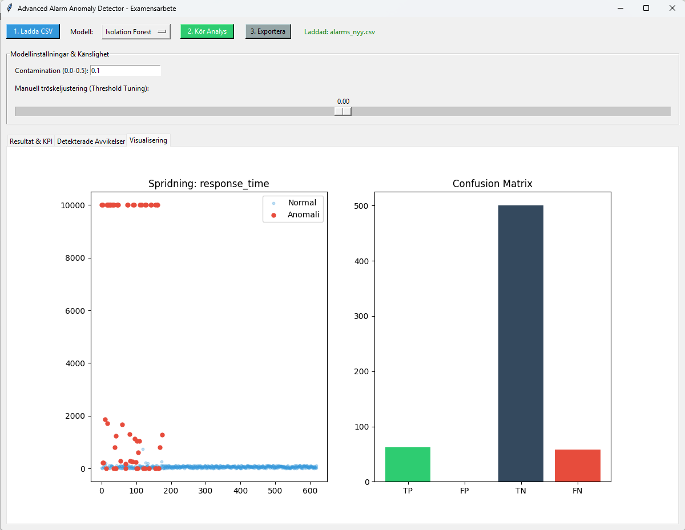

# 🚨 Alarm Anomaly Detector

A machine learning project for detecting anomalies in alarm system data.

## Features

- Alarm anomaly detection
- Synthetic dataset generation
- Machine learning model
- Windows executable support

## Project Structure

```txt
assets/         -> icons and resources
data/           -> data generation modules
src/            -> application source code
generate_data.py
```

## Installation

Clone the repository:

```bash
git clone https://github.com/MikayilNematov/alarm-anomaly-detector.git
```

Install dependencies:

```bash
pip install -r requirements.txt
```

Run the application:

```bash
python src/main.py
```

Generate dataset:

```bash
python generate_data.py
```

## Download

The executable version (.exe) is available in **Releases**.

## Author

Mikayil Nematov
